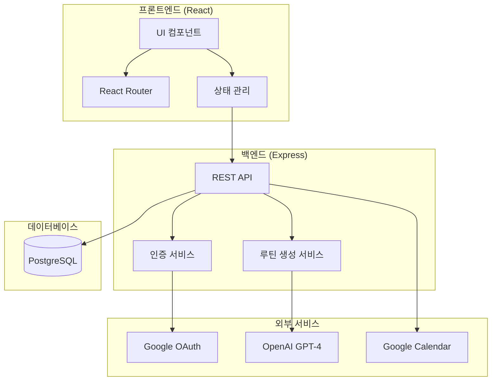
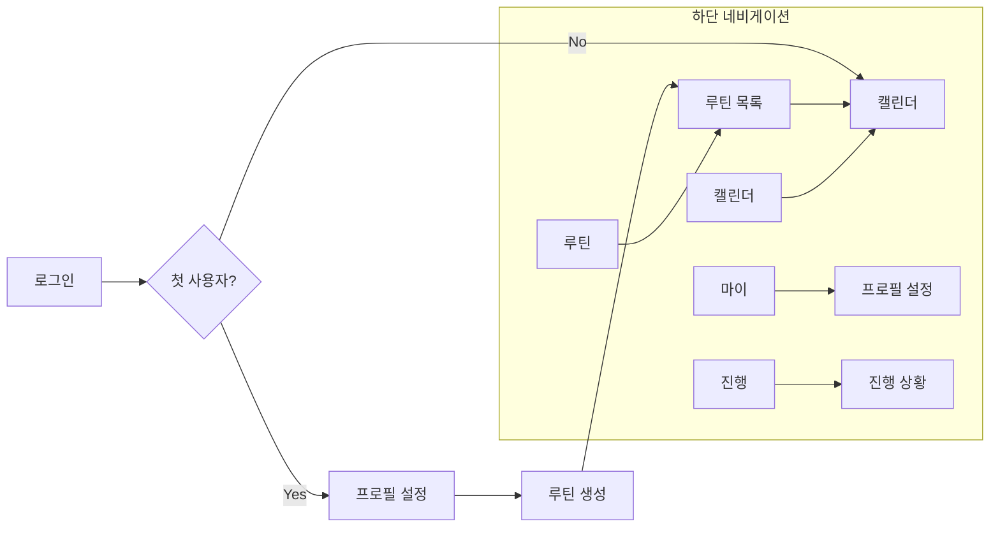

# 설계 문서

## 개요

개인 맞춤형 헬스 루틴 플래너 - 모바일 우선 웹 애플리케이션

**핵심 기능:**
1. 구글 소셜 로그인
2. 사용자 프로필 설정
3. AI(GPT-4) 기반 맞춤 루틴 생성
4. 루틴 관리 (활성화/비활성화, 편집, 복제, 삭제)
5. 캘린더 뷰 (오늘/주간/월간)
6. 진행 상황 추적

**기술 스택:** React + TypeScript + Tailwind CSS + Node.js + Express + PostgreSQL + OpenAI API

---

## 아키텍처



---

## 유저 플로우



---

## 화면 구조

### 라우트 구성

| 경로 | 화면 | 설명 |
|-----|------|------|
| `/` | 로그인 | 구글 로그인 버튼 |
| `/profile/setup` | 프로필 설정 | 다단계 첫 사용자 온보딩 |
| `/profile/setup/basic` | 기본 정보 | 1단계: 연령, 성별, 키, 몸무게 |
| `/profile/setup/environment` | 운동 환경 | 2단계: 운동 장소, 주간 횟수 |
| `/profile/setup/goals` | 목표 설정 | 3단계: 운동 목표, 초점 부위 |
| `/profile/setup/condition` | 신체 조건 | 4단계: 체력 수준, 불편한 부위 |
| `/profile/setup/experience` | 운동 경력 | 5단계: 경력 수준, 상세 기록 |
| `/profile/setup/duration` | 플랜 기간 | 6단계: 플랜 기간 설정 |
| `/my` | 마이페이지 | 사용자 정보, 설정 메뉴 |
| `/my/profile` | 프로필 수정 | 프로필 정보 수정 |
| `/routines` | 루틴 목록 | 루틴 관리 |
| `/routines/new` | 루틴 생성 | AI 루틴 생성 |
| `/routines/:id/edit` | 루틴 편집 | 운동 항목 자유 편집 |
| `/routines/:id/workout/:day` | 운동 상세 | 특정 날짜 운동 편집 |
| `/calendar` | 캘린더 | 오늘/주간/월간 뷰 (메인) |
| `/progress` | 진행 상황 | 통계, 기록 |

### 하단 네비게이션

```
[마이] [루틴] [캘린더] [진행]
  👤     📋      📅      📊
```

---

## 데이터 모델

### TypeScript 인터페이스

```typescript
// 사용자
interface User {
  id: string;
  googleId: string;
  email: string;
  name: string;
  profilePicture?: string;
  isFirstLogin: boolean;
  createdAt: Date;
}

// 프로필 (확장된 정보)
interface Profile {
  userId: string;
  // 기본 정보
  age: number;                   // 15-80
  gender: 'male' | 'female' | 'other';
  height: number;                // cm (100-250)
  weight: number;                // kg (30-300)
  
  // 운동 환경
  workoutLocation: WorkoutLocation;
  weeklyWorkouts: number;        // 1-7회
  
  // 목표 및 초점
  goal: Goal;
  focus: Focus;
  
  // 신체 조건
  fitnessLevel: FitnessLevel;
  uncomfortableAreas: UncomfortableArea[];
  
  // 운동 경력
  experienceLevel: ExperienceLevel;
  exerciseHistory?: ExerciseHistory[];
  
  // 플랜 설정
  planDuration: number;          // 4, 8, 12, 16주
  
  createdAt: Date;
  updatedAt: Date;
}

type WorkoutLocation = 'gym' | 'home' | 'outdoor' | 'mixed';
type Goal = 'strength' | 'weight_loss' | 'endurance' | 'muscle_gain' | 'body_correction';
type Focus = 'upper_body' | 'lower_body' | 'full_body' | 'core';
type FitnessLevel = 'beginner' | 'novice' | 'intermediate' | 'advanced';
type UncomfortableArea = 'neck' | 'shoulder' | 'back' | 'knee' | 'ankle' | 'wrist';
type ExperienceLevel = 'none' | 'under_6months' | '6months_1year' | '1year_3years' | 'over_3years';

interface ExerciseHistory {
  exerciseName: string;          // "벤치프레스", "스쿼트", "데드리프트" 등
  maxWeight: number;             // kg
  reps: number;                  // 반복 횟수
}

// 루틴 설정
interface RoutineSettings {
  durationWeeks: number;     // 2, 4, 6, 8, 12
  workoutsPerWeek: number;   // 2-6
  splitType: SplitType;
  additionalRequest?: string;
}

type SplitType = 'full_body' | 'upper_lower' | 'push_pull_legs';

// 루틴
interface Routine {
  id: string;
  userId: string;
  name: string;
  settings: RoutineSettings;
  workouts: Workout[];
  isActive: boolean;         // 1개만 true 가능
  createdAt: Date;
  updatedAt: Date;
}

// 운동일
interface Workout {
  id: string;
  dayNumber: number;
  name: string;              // "Day 1 - 상체"
  exercises: Exercise[];
}

// 근육 그룹
type MuscleGroup = 'chest' | 'back' | 'shoulders' | 'arms' | 'abs' | 'legs' | 'full_body';

// 운동 항목 (근육 그룹 정보 추가)
interface Exercise {
  id: string;
  name: string;
  sets: number;
  reps: string;              // "8-10" 또는 "30초"
  muscleGroup: MuscleGroup;  // 주요 타겟 근육
  description?: string;      // 운동 설명 (선택)
}

// 운동 기록
interface WorkoutLog {
  id: string;
  userId: string;
  routineId: string;
  workoutId: string;
  date: string;              // "2024-12-24"
  completedExercises: string[];  // exercise id 배열
  isCompleted: boolean;
}
```

### 데이터베이스 스키마

```sql
-- 사용자
CREATE TABLE users (
  id UUID PRIMARY KEY DEFAULT gen_random_uuid(),
  google_id VARCHAR(255) UNIQUE NOT NULL,
  email VARCHAR(255) UNIQUE NOT NULL,
  name VARCHAR(100) NOT NULL,
  profile_picture VARCHAR(500),
  is_first_login BOOLEAN DEFAULT TRUE,
  created_at TIMESTAMP DEFAULT NOW()
);

-- 프로필 (확장된 스키마)
CREATE TABLE profiles (
  id UUID PRIMARY KEY DEFAULT gen_random_uuid(),
  user_id UUID UNIQUE REFERENCES users(id) ON DELETE CASCADE,
  
  -- 기본 정보
  age INTEGER NOT NULL CHECK (age >= 15 AND age <= 80),
  gender VARCHAR(10) NOT NULL CHECK (gender IN ('male', 'female', 'other')),
  height INTEGER NOT NULL CHECK (height >= 100 AND height <= 250),
  weight INTEGER NOT NULL CHECK (weight >= 30 AND weight <= 300),
  
  -- 운동 환경
  workout_location VARCHAR(20) NOT NULL CHECK (workout_location IN ('gym', 'home', 'outdoor', 'mixed')),
  weekly_workouts INTEGER NOT NULL CHECK (weekly_workouts >= 1 AND weekly_workouts <= 7),
  
  -- 목표 및 초점
  goal VARCHAR(20) NOT NULL CHECK (goal IN ('strength', 'weight_loss', 'endurance', 'muscle_gain', 'body_correction')),
  focus VARCHAR(20) NOT NULL CHECK (focus IN ('upper_body', 'lower_body', 'full_body', 'core')),
  
  -- 신체 조건
  fitness_level VARCHAR(20) NOT NULL CHECK (fitness_level IN ('beginner', 'novice', 'intermediate', 'advanced')),
  uncomfortable_areas JSONB DEFAULT '[]', -- ['neck', 'shoulder', 'back', 'knee', 'ankle', 'wrist']
  
  -- 운동 경력
  experience_level VARCHAR(20) NOT NULL CHECK (experience_level IN ('none', 'under_6months', '6months_1year', '1year_3years', 'over_3years')),
  exercise_history JSONB DEFAULT '[]', -- [{"exerciseName": "벤치프레스", "maxWeight": 60, "reps": 8}]
  
  -- 플랜 설정
  plan_duration INTEGER NOT NULL CHECK (plan_duration IN (4, 8, 12, 16)),
  
  created_at TIMESTAMP DEFAULT NOW(),
  updated_at TIMESTAMP DEFAULT NOW()
);

-- 루틴
CREATE TABLE routines (
  id UUID PRIMARY KEY DEFAULT gen_random_uuid(),
  user_id UUID REFERENCES users(id) ON DELETE CASCADE,
  name VARCHAR(100) NOT NULL,
  settings JSONB NOT NULL,
  workouts JSONB NOT NULL,
  is_active BOOLEAN DEFAULT FALSE,
  created_at TIMESTAMP DEFAULT NOW(),
  updated_at TIMESTAMP DEFAULT NOW()
);

-- 운동 기록 (근육 그룹 정보 포함)
CREATE TABLE workout_logs (
  id UUID PRIMARY KEY DEFAULT gen_random_uuid(),
  user_id UUID REFERENCES users(id) ON DELETE CASCADE,
  routine_id UUID REFERENCES routines(id) ON DELETE CASCADE,
  workout_id VARCHAR(50) NOT NULL,
  date DATE NOT NULL,
  completed_exercises JSONB DEFAULT '[]',
  is_completed BOOLEAN DEFAULT FALSE,
  created_at TIMESTAMP DEFAULT NOW(),
  UNIQUE(user_id, routine_id, workout_id, date)
);

-- 근육 그룹 상수 (체크 제약)
ALTER TABLE routines ADD CONSTRAINT valid_muscle_groups 
CHECK (workouts::text ~ '"muscleGroup":\s*"(chest|back|shoulders|arms|abs|legs|full_body)"');
```

---

## API 엔드포인트

### 인증

| Method | Endpoint | 설명 |
|--------|----------|------|
| GET | `/api/auth/google` | 구글 OAuth 시작 |
| GET | `/api/auth/google/callback` | OAuth 콜백 |
| GET | `/api/auth/me` | 현재 사용자 정보 |
| POST | `/api/auth/logout` | 로그아웃 |

### 프로필

| Method | Endpoint | 설명 |
|--------|----------|------|
| GET | `/api/profile` | 프로필 조회 |
| POST | `/api/profile` | 프로필 생성 |
| PUT | `/api/profile` | 프로필 수정 |

### 루틴

| Method | Endpoint | 설명 |
|--------|----------|------|
| GET | `/api/routines` | 루틴 목록 |
| GET | `/api/routines/active` | 활성 루틴 |
| GET | `/api/routines/:id` | 루틴 상세 |
| POST | `/api/routines/generate` | AI 루틴 생성 |
| PUT | `/api/routines/:id` | 루틴 수정 |
| DELETE | `/api/routines/:id` | 루틴 삭제 |
| POST | `/api/routines/:id/activate` | 활성화 |
| POST | `/api/routines/:id/duplicate` | 복제 |
| PUT | `/api/routines/:id/exercises/:exerciseId` | 운동 항목 수정 |
| POST | `/api/routines/:id/exercises` | 운동 항목 추가 |
| DELETE | `/api/routines/:id/exercises/:exerciseId` | 운동 항목 삭제 |
| PUT | `/api/routines/:id/exercises/reorder` | 운동 순서 변경 |

### 운동 기록

| Method | Endpoint | 설명 |
|--------|----------|------|
| GET | `/api/logs/today` | 오늘 기록 |
| GET | `/api/logs/week` | 주간 기록 |
| GET | `/api/logs/month/:year/:month` | 월간 기록 |
| POST | `/api/logs` | 기록 저장/업데이트 |
| GET | `/api/logs/stats` | 통계 |

---

## AI 루틴 생성

### OpenAI API 호출

```typescript
const systemPrompt = `당신은 전문 피트니스 트레이너입니다.
사용자의 상세한 정보를 바탕으로 맞춤형 운동 루틴을 생성하세요.

사용자 정보 분석:
1. 연령/성별에 따른 운동 강도 조절
2. 운동 장소에 맞는 운동 선택 (헬스장/홈트/야외)
3. 체력 수준과 운동 경력에 맞는 난이도
4. 운동 목표와 초점 부위 반영
5. 불편한 부위 피하는 운동 구성
6. 기존 운동 경력 기반 중량/강도 설정

규칙:
1. 불편한 부위는 절대 무리하지 않는 운동 선택
2. 운동 장소에 맞는 장비만 사용
3. 운동 경력이 있으면 기존 중량 기준으로 점진적 증가
4. 주간 운동 횟수에 맞는 분할 방식 적용
5. 각 운동에 적절한 근육 그룹 할당
6. JSON 형식으로만 응답

응답 형식:
{
  "name": "루틴 이름",
  "workouts": [
    {
      "dayNumber": 1,
      "name": "Day 1 - 상체",
      "exercises": [
        {
          "name": "벤치프레스", 
          "sets": 3, 
          "reps": "8-10",
          "muscleGroup": "chest",
          "weight": "60kg (기존 경력 기준)" // 운동 경력이 있는 경우
        }
      ]
    }
  ]
}

근육 그룹 옵션:
- chest: 가슴
- back: 등
- shoulders: 어깨
- arms: 팔 (이두/삼두)
- abs: 복근
- legs: 하체 (대퇴/둔근/종아리)
- full_body: 전신

운동 장소별 장비:
- gym: 모든 장비 사용 가능
- home: 덤벨, 맨몸운동, 밴드 위주
- outdoor: 맨몸운동, 공원 시설 활용
- mixed: 상황에 맞게 조합`;

async function generateRoutine(profile: Profile, settings: RoutineSettings) {
  const userPrompt = `
사용자 정보:
- 연령: ${profile.age}세, 성별: ${profile.gender}
- 신체: 키 ${profile.height}cm, 몸무게 ${profile.weight}kg
- 운동 장소: ${profile.workoutLocation}
- 주간 운동 횟수: ${profile.weeklyWorkouts}회
- 목표: ${profile.goal}, 초점: ${profile.focus}
- 체력 수준: ${profile.fitnessLevel}
- 불편한 부위: ${profile.uncomfortableAreas.join(', ') || '없음'}
- 운동 경력: ${profile.experienceLevel}
- 기존 운동 기록: ${JSON.stringify(profile.exerciseHistory || [])}
- 플랜 기간: ${profile.planDuration}주

루틴 설정:
- 기간: ${settings.durationWeeks}주
- 주당 횟수: ${settings.workoutsPerWeek}회
- 분할 방식: ${settings.splitType}
- 추가 요청: ${settings.additionalRequest || '없음'}

위 정보를 바탕으로 맞춤형 운동 루틴을 생성해주세요.
  `;

  const response = await openai.chat.completions.create({
    model: "gpt-4",
    messages: [
      { role: "system", content: systemPrompt },
      { role: "user", content: userPrompt }
    ],
    response_format: { type: "json_object" },
    temperature: 0.7
  });
  
  return JSON.parse(response.choices[0].message.content);
}
```

---

## 캘린더 뷰 로직

### 오늘 뷰
- 활성 루틴에서 오늘 날짜에 해당하는 운동 표시
- 루틴 시작일 기준으로 Day N 계산
- 완료 상태는 workout_logs 테이블에서 조회

### 주간 뷰
- 월~금 5일 그리드 표시
- 각 날짜별 운동 유무 및 완료 상태 표시
- 날짜 선택 시 해당 운동 목록 표시

### 월간 뷰
- 달력 형태로 전체 월 표시
- 운동일: ✅(완료) / ·(예정)
- 휴식일: 빈칸
- 하단에 월간 통계 표시

---

## 컴포넌트 구조

```
src/
├── components/
│   ├── common/
│   │   ├── Button.tsx
│   │   ├── Input.tsx
│   │   ├── Card.tsx
│   │   ├── ProgressBar.tsx
│   │   └── Loading.tsx
│   ├── layout/
│   │   ├── BottomNav.tsx
│   │   └── Header.tsx
│   ├── calendar/
│   │   ├── TodayView.tsx
│   │   ├── WeekView.tsx
│   │   ├── MonthView.tsx
│   │   └── ExerciseItem.tsx
│   ├── routine/
│   │   ├── RoutineCard.tsx
│   │   ├── RoutineForm.tsx
│   │   ├── RoutineEditor.tsx      # 루틴 전체 편집
│   │   ├── ExerciseEditor.tsx     # 개별 운동 편집
│   │   ├── ExerciseItem.tsx       # 운동 항목 표시
│   │   ├── MuscleGroupBadge.tsx   # 근육 그룹 태그
│   │   └── ExerciseLibrary.tsx    # 운동 라이브러리
│   └── profile/
│       ├── ProfileForm.tsx         # 전체 프로필 폼 컨테이너
│       ├── BasicInfoForm.tsx       # 기본 정보 입력
│       ├── WorkoutEnvironmentForm.tsx  # 운동 환경 설정
│       ├── GoalsForm.tsx           # 목표 및 초점 설정
│       ├── PhysicalConditionForm.tsx   # 신체 조건 입력
│       ├── ExperienceForm.tsx      # 운동 경력 입력
│       ├── PlanDurationForm.tsx    # 플랜 기간 설정
│       └── ProgressIndicator.tsx   # 단계별 진행률 표시
├── pages/
│   ├── LoginPage.tsx
│   ├── ProfileSetupPage.tsx        # 다단계 프로필 설정
│   ├── ProfileStepPages/           # 프로필 설정 단계별 페이지
│   │   ├── BasicInfoStep.tsx       # 1단계: 기본 정보
│   │   ├── WorkoutEnvironmentStep.tsx  # 2단계: 운동 환경
│   │   ├── GoalsStep.tsx           # 3단계: 목표 및 초점
│   │   ├── PhysicalConditionStep.tsx   # 4단계: 신체 조건
│   │   ├── ExperienceStep.tsx      # 5단계: 운동 경력
│   │   └── PlanDurationStep.tsx    # 6단계: 플랜 기간
│   ├── MyPage.tsx
│   ├── RoutinesPage.tsx
│   ├── RoutineNewPage.tsx
│   ├── RoutineEditPage.tsx
│   ├── CalendarPage.tsx
│   └── ProgressPage.tsx
├── hooks/
│   ├── useAuth.ts
│   ├── useRoutines.ts
│   └── useWorkoutLogs.ts
├── services/
│   └── api.ts
└── types/
    └── index.ts
```

---

## 오류 처리

| 상황 | 처리 |
|-----|------|
| AI 생성 실패 | 재시도 버튼 표시 |
| 네트워크 오류 | 오프라인 안내 + 재시도 |
| 인증 만료 | 자동 로그아웃 + 로그인 유도 |
| 루틴 10개 초과 | 생성 버튼 비활성화 + 안내 |

---

## 테스트 전략

### 단위 테스트
- 루틴 활성화 로직 (1개만 활성화)
- 진행률 계산
- 날짜별 운동 매핑

### 통합 테스트
- 로그인 → 프로필 설정 → 루틴 생성 플로우
- 운동 완료 → 기록 저장 → 통계 업데이트

### E2E 테스트
- 전체 사용자 시나리오
- 모바일 뷰포트 테스트
