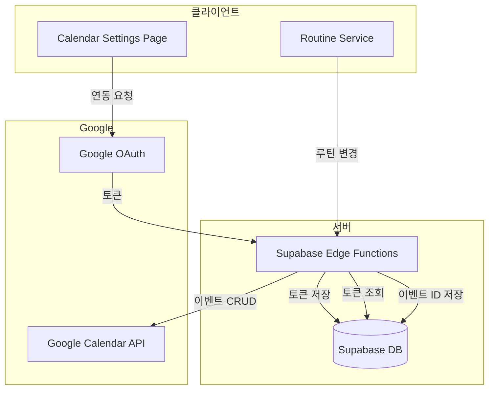
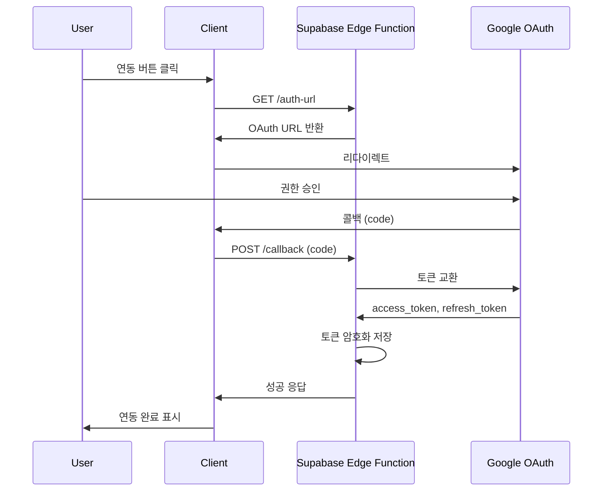

# Design Document: Google Calendar Integration

## Overview

구글 캘린더 API를 활용하여 운동 루틴을 구글 캘린더와 양방향 동기화합니다. OAuth 2.0 인증을 통해 사용자의 구글 계정에 접근하고, 루틴 활성화/수정/삭제 시 캘린더 이벤트를 자동으로 관리합니다.

## Architecture



## Components and Interfaces

### 1. CalendarSettingsPage

캘린더 연동 설정을 관리하는 페이지 컴포넌트입니다.

```typescript
// src/pages/CalendarSettingsPage.tsx
interface CalendarConnectionState {
  isConnected: boolean;
  googleEmail: string | null;
  lastSyncAt: Date | null;
  syncStatus: 'idle' | 'syncing' | 'error';
  errorMessage: string | null;
}
```

### 2. GoogleCalendarService

구글 캘린더 API와 통신하는 서비스입니다.

```typescript
// src/services/googleCalendar.ts
interface CalendarEvent {
  id?: string;
  summary: string;        // 운동 이름 (예: "Day 1: 가슴/삼두")
  description: string;    // 운동 목록
  start: { date: string };  // 종일 이벤트: YYYY-MM-DD 형식
  end: { date: string };    // 종일 이벤트: YYYY-MM-DD 형식 (시작일 다음날)
  colorId?: string;       // 캘린더 색상
  reminders?: {
    useDefault: boolean;
    overrides?: Array<{ method: string; minutes: number }>;
  };
}

interface GoogleCalendarService {
  // OAuth 관련
  getAuthUrl(): string;
  handleCallback(code: string): Promise<OAuthTokens>;
  refreshToken(refreshToken: string): Promise<OAuthTokens>;
  revokeAccess(userId: string): Promise<void>;
  
  // 연동 상태
  getConnectionStatus(userId: string): Promise<CalendarConnectionState>;
  
  // 이벤트 관리
  createEvents(userId: string, routineId: string, events: CalendarEvent[]): Promise<string[]>;
  updateEvent(userId: string, eventId: string, event: CalendarEvent): Promise<void>;
  deleteEvents(userId: string, eventIds: string[]): Promise<void>;
  
  // 동기화
  syncRoutine(userId: string, routineId: string): Promise<void>;
  syncAllRoutines(userId: string): Promise<void>;
}
```

### 3. Supabase Edge Functions

서버 사이드에서 구글 API와 통신합니다.

```typescript
// supabase/functions/google-calendar/index.ts

// POST /google-calendar/auth - OAuth 콜백 처리
// POST /google-calendar/events - 이벤트 생성
// PATCH /google-calendar/events/:id - 이벤트 수정
// DELETE /google-calendar/events - 이벤트 삭제
// POST /google-calendar/sync - 전체 동기화
// DELETE /google-calendar/disconnect - 연동 해제
```

### 4. Routine Service 확장

루틴 변경 시 캘린더 동기화를 트리거합니다.

```typescript
// src/services/routines.ts 확장
interface RoutineServiceExtension {
  // 기존 메서드에 캘린더 동기화 추가
  activateRoutine(routineId: string): Promise<void>;   // + 캘린더 이벤트 생성
  deactivateRoutine(routineId: string): Promise<void>; // + 캘린더 이벤트 삭제
  updateRoutine(routineId: string, data: RoutineUpdate): Promise<void>; // + 캘린더 이벤트 수정
  deleteRoutine(routineId: string): Promise<void>;     // + 캘린더 이벤트 삭제
}
```

## Data Models

### google_calendar_tokens 테이블

```sql
CREATE TABLE google_calendar_tokens (
  id UUID PRIMARY KEY DEFAULT gen_random_uuid(),
  user_id UUID REFERENCES auth.users(id) ON DELETE CASCADE,
  access_token TEXT NOT NULL,
  refresh_token TEXT NOT NULL,
  token_expiry TIMESTAMP WITH TIME ZONE NOT NULL,
  google_email TEXT,
  created_at TIMESTAMP WITH TIME ZONE DEFAULT NOW(),
  updated_at TIMESTAMP WITH TIME ZONE DEFAULT NOW(),
  UNIQUE(user_id)
);

-- RLS 정책
ALTER TABLE google_calendar_tokens ENABLE ROW LEVEL SECURITY;

CREATE POLICY "Users can manage own tokens"
  ON google_calendar_tokens FOR ALL
  USING (auth.uid() = user_id);
```

### calendar_event_mappings 테이블

```sql
CREATE TABLE calendar_event_mappings (
  id UUID PRIMARY KEY DEFAULT gen_random_uuid(),
  user_id UUID REFERENCES auth.users(id) ON DELETE CASCADE,
  routine_id UUID REFERENCES routines(id) ON DELETE CASCADE,
  workout_id UUID REFERENCES workouts(id) ON DELETE CASCADE,
  google_event_id TEXT NOT NULL,
  event_date DATE NOT NULL,
  created_at TIMESTAMP WITH TIME ZONE DEFAULT NOW(),
  UNIQUE(workout_id, event_date)
);

-- RLS 정책
ALTER TABLE calendar_event_mappings ENABLE ROW LEVEL SECURITY;

CREATE POLICY "Users can manage own mappings"
  ON calendar_event_mappings FOR ALL
  USING (auth.uid() = user_id);

-- 인덱스
CREATE INDEX idx_calendar_mappings_routine ON calendar_event_mappings(routine_id);
CREATE INDEX idx_calendar_mappings_user ON calendar_event_mappings(user_id);
```

### calendar_sync_status 테이블

```sql
CREATE TABLE calendar_sync_status (
  id UUID PRIMARY KEY DEFAULT gen_random_uuid(),
  user_id UUID REFERENCES auth.users(id) ON DELETE CASCADE,
  last_sync_at TIMESTAMP WITH TIME ZONE,
  sync_status TEXT DEFAULT 'idle', -- 'idle', 'syncing', 'error'
  error_message TEXT,
  created_at TIMESTAMP WITH TIME ZONE DEFAULT NOW(),
  updated_at TIMESTAMP WITH TIME ZONE DEFAULT NOW(),
  UNIQUE(user_id)
);
```

## Correctness Properties

*A property is a characteristic or behavior that should hold true across all valid executions of a system-essentially, a formal statement about what the system should do. Properties serve as the bridge between human-readable specifications and machine-verifiable correctness guarantees.*

### Property 1: 캘린더 동기화 일관성

*For any* 활성화된 루틴, 해당 루틴의 모든 운동 일정이 구글 캘린더에 존재해야 하고, 루틴 비활성화/삭제 시 모든 관련 이벤트가 삭제되어야 한다.

**Validates: Requirements 2.1, 3.1, 3.2, 4.1, 4.2, 5.3, 6.4**

### Property 2: 이벤트 데이터 완전성

*For any* 생성된 캘린더 이벤트, 운동 이름(summary), 운동 목록(description), 날짜(date)가 반드시 포함되어야 하고, 종일 이벤트 형식이어야 한다.

**Validates: Requirements 2.2, 2.3**

### Property 3: 토큰 및 매핑 데이터 영속성

*For any* OAuth 토큰 또는 이벤트 매핑 데이터, 저장 후 조회하면 동일한 데이터를 반환해야 하고, 연동 해제 시 모든 관련 데이터가 삭제되어야 한다.

**Validates: Requirements 1.3, 2.3, 4.3, 5.4**

## Error Handling

| 에러 상황 | 처리 방법 |
|----------|----------|
| OAuth 인증 실패 | 에러 메시지 표시, 재시도 버튼 제공 |
| 토큰 만료 | 자동 refresh, 실패 시 재인증 요청 |
| API 할당량 초과 | 지수 백오프로 재시도, 사용자에게 알림 |
| 이벤트 생성 실패 | 개별 이벤트 재시도, 실패 로깅 |
| 네트워크 오류 | 재시도 큐에 추가, 오프라인 상태 표시 |

## Testing Strategy

### Unit Tests
- OAuth URL 생성 로직
- 이벤트 데이터 변환 로직 (루틴 → CalendarEvent)
- 토큰 만료 확인 로직

### Property-Based Tests (fast-check)
- **Property 1**: 루틴 상태 변경 시 캘린더 이벤트 일관성
- **Property 2**: 이벤트 데이터 필수 필드 검증
- **Property 3**: 토큰/매핑 데이터 round-trip

### Integration Tests
- OAuth 플로우 (인증 → 토큰 저장)
- 루틴 활성화 → 이벤트 생성 플로우
- 연동 해제 → 데이터 정리 플로우

## Environment Variables

```bash
# Google OAuth (Google Cloud Console에서 생성)
GOOGLE_CLIENT_ID=your_client_id
GOOGLE_CLIENT_SECRET=your_client_secret
GOOGLE_REDIRECT_URI=https://your-domain.com/auth/google/callback

# Supabase Edge Function에서 사용
GOOGLE_CALENDAR_SCOPES=https://www.googleapis.com/auth/calendar.events
```

## OAuth Flow


