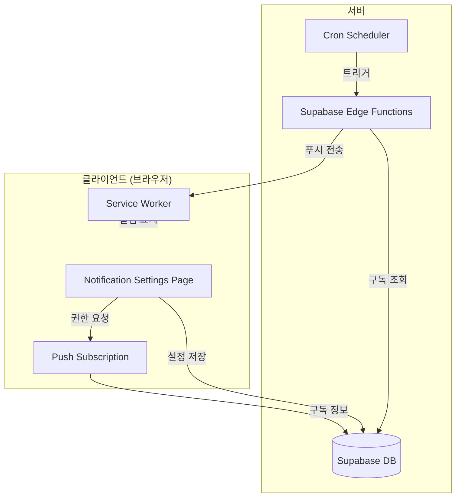

# Design Document: Push Notifications

## Overview

PWA 기반 웹 푸시 알림 시스템을 구현합니다. Web Push API와 Service Worker를 활용하여 운동 리마인더와 주간 요약 알림을 제공합니다. 서버 사이드 푸시 전송은 Supabase Edge Functions를 사용합니다.

## Architecture



## Components and Interfaces

### 1. NotificationSettingsPage

알림 설정을 관리하는 페이지 컴포넌트입니다.

```typescript
// src/pages/NotificationSettingsPage.tsx
interface NotificationSettings {
  workoutReminder: boolean;
  reminderTime: '30min' | '1hour' | '2hours';
  weeklySummary: boolean;
}

interface NotificationState {
  permission: NotificationPermission; // 'default' | 'granted' | 'denied'
  isSubscribed: boolean;
  isSupported: boolean;
  isIOSBrowser: boolean; // iOS Safari (not PWA)
  settings: NotificationSettings;
}
```

### 2. PushNotificationService

푸시 알림 구독 및 설정을 관리하는 서비스입니다.

```typescript
// src/services/pushNotification.ts
interface PushSubscriptionData {
  endpoint: string;
  keys: {
    p256dh: string;
    auth: string;
  };
}

interface PushNotificationService {
  // 브라우저 지원 여부 확인
  isSupported(): boolean;
  
  // iOS Safari 감지 (PWA가 아닌 경우)
  isIOSBrowser(): boolean;
  
  // 권한 요청 및 구독
  requestPermission(): Promise<NotificationPermission>;
  subscribe(): Promise<PushSubscriptionData | null>;
  unsubscribe(): Promise<boolean>;
  
  // 설정 관리
  getSettings(userId: string): Promise<NotificationSettings>;
  updateSettings(userId: string, settings: NotificationSettings): Promise<void>;
  
  // 구독 정보 저장/삭제
  saveSubscription(userId: string, subscription: PushSubscriptionData): Promise<void>;
  deleteSubscription(userId: string): Promise<void>;
}
```

### 3. Service Worker Push Handler

푸시 이벤트를 처리하는 Service Worker 확장입니다.

```typescript
// public/sw-push.js (vite-plugin-pwa에 inject)
self.addEventListener('push', (event) => {
  const data = event.data?.json();
  const options = {
    body: data.body,
    icon: '/pwa-192x192.png',
    badge: '/badge-72x72.png',
    data: { url: data.url || '/' },
    actions: data.actions || []
  };
  event.waitUntil(
    self.registration.showNotification(data.title, options)
  );
});

self.addEventListener('notificationclick', (event) => {
  event.notification.close();
  const url = event.notification.data?.url || '/';
  event.waitUntil(
    clients.openWindow(url)
  );
});
```

### 4. Supabase Edge Function

푸시 알림을 전송하는 서버리스 함수입니다.

```typescript
// supabase/functions/send-push/index.ts
interface PushPayload {
  title: string;
  body: string;
  url?: string;
  actions?: Array<{ action: string; title: string }>;
}

// web-push 라이브러리 사용
// VAPID 키로 암호화된 푸시 전송
```

## Data Models

### push_subscriptions 테이블

```sql
CREATE TABLE push_subscriptions (
  id UUID PRIMARY KEY DEFAULT gen_random_uuid(),
  user_id UUID REFERENCES auth.users(id) ON DELETE CASCADE,
  endpoint TEXT NOT NULL,
  p256dh TEXT NOT NULL,
  auth TEXT NOT NULL,
  created_at TIMESTAMP WITH TIME ZONE DEFAULT NOW(),
  updated_at TIMESTAMP WITH TIME ZONE DEFAULT NOW(),
  UNIQUE(user_id)
);

-- RLS 정책
ALTER TABLE push_subscriptions ENABLE ROW LEVEL SECURITY;

CREATE POLICY "Users can manage own subscriptions"
  ON push_subscriptions FOR ALL
  USING (auth.uid() = user_id);
```

### notification_settings 테이블

```sql
CREATE TABLE notification_settings (
  id UUID PRIMARY KEY DEFAULT gen_random_uuid(),
  user_id UUID REFERENCES auth.users(id) ON DELETE CASCADE,
  workout_reminder BOOLEAN DEFAULT true,
  reminder_time TEXT DEFAULT '1hour', -- '30min', '1hour', '2hours'
  weekly_summary BOOLEAN DEFAULT true,
  created_at TIMESTAMP WITH TIME ZONE DEFAULT NOW(),
  updated_at TIMESTAMP WITH TIME ZONE DEFAULT NOW(),
  UNIQUE(user_id)
);

-- RLS 정책
ALTER TABLE notification_settings ENABLE ROW LEVEL SECURITY;

CREATE POLICY "Users can manage own settings"
  ON notification_settings FOR ALL
  USING (auth.uid() = user_id);
```

## Correctness Properties

*A property is a characteristic or behavior that should hold true across all valid executions of a system-essentially, a formal statement about what the system should do. Properties serve as the bridge between human-readable specifications and machine-verifiable correctness guarantees.*

### Property 1: 구독 데이터 영속성

*For any* 유효한 푸시 구독 정보, 저장 후 조회하면 동일한 endpoint와 keys를 반환해야 한다 (round-trip property).

**Validates: Requirements 1.2, 2.4, 5.2**

### Property 2: 비활성화 시 알림 미전송

*For any* 알림 설정이 비활성화된 사용자, 해당 유형의 알림이 전송되지 않아야 한다.

**Validates: Requirements 3.3, 4.2**

### Property 3: 알림 생성 정확성

*For any* 활성화된 운동 리마인더 설정과 오늘의 운동 일정, 설정된 시간에 올바른 운동 정보가 포함된 알림이 생성되어야 한다.

**Validates: Requirements 3.1**

## Error Handling

| 에러 상황 | 처리 방법 |
|----------|----------|
| 브라우저 미지원 | 지원 안내 메시지 표시, 설정 UI 비활성화 |
| 권한 거부 | 브라우저 설정 안내 표시 |
| iOS Safari | "홈 화면에 추가" 안내 표시 |
| 구독 실패 | 재시도 버튼 제공, 에러 로깅 |
| 푸시 전송 실패 | 재시도 큐에 추가, 3회 실패 시 구독 무효화 |

## Testing Strategy

### Unit Tests
- `isSupported()` 함수의 브라우저 감지 로직
- `isIOSBrowser()` 함수의 iOS Safari 감지 로직
- 알림 설정 유효성 검증
- 푸시 페이로드 생성 로직

### Property-Based Tests (fast-check)
- **Property 1**: 구독 데이터 저장/조회 round-trip
- **Property 2**: 비활성화 상태에서 알림 미생성 검증
- **Property 3**: 알림 페이로드 정확성 검증

### Integration Tests
- 권한 요청 → 구독 → 설정 저장 플로우
- 구독 해제 플로우
- Edge Function 푸시 전송

## Environment Variables

```bash
# VAPID Keys (web-push generate-vapid-keys로 생성)
VITE_VAPID_PUBLIC_KEY=your_public_key
VAPID_PRIVATE_KEY=your_private_key  # Edge Function에서만 사용
VAPID_SUBJECT=mailto:your@email.com
```
